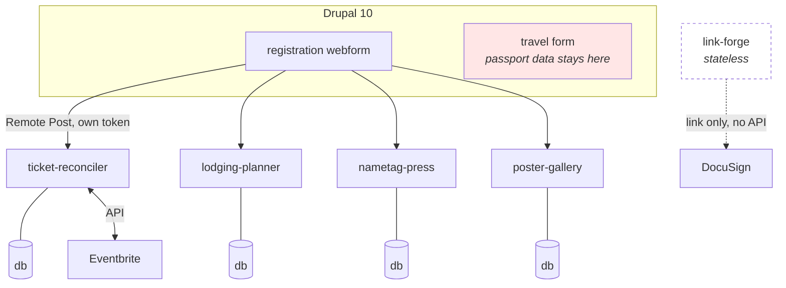

# Architecture

One Drupal form fans out to up to five independent applications. Each keeps its
own database and none depends on another at runtime.

The separate cylinders are the point, not an accident — see
[DECISIONS](DECISIONS.md).

## How a registration travels

1. Someone submits the Drupal form; a `computed_twig` element works out their
   ticket slug.
2. Drupal fires every Remote Post handler configured for **Completed**, each
   with its own token.
3. Each application verifies the token, parses the payload through the one
   parser in `eventkit.drupal`, derives a `person_key` preferring the Drupal
   submission uuid, upserts, and returns 200 in about 200 ms.
4. `ticket-reconciler` separately pulls Eventbrite attendees and matches on
   email.

Configure handlers for **Completed only, errors ignored, short timeout**. Five
synchronous handlers on one form is real coupling: otherwise one slow
application delays every registrant, and one that is down loses submissions.

## Who touches what

| | Reaches |
|---|---|
| Registrant | the Drupal form |
| Anyone | the public half of `poster-gallery` |
| Front desk | `ticket-reconciler` |
| Lodging planner | `lodging-planner` |
| Print staff | `nametag-press` |
| Finance and event staff | `link-forge` |

Only the first two are reachable without signing in. Everything else is behind
Easy Auth with a **per-application** allow-list — which is how finance staff get
reimbursement links without also getting gross revenue.

## Timeline

| When | What |
|---|---|
| T-10 weeks | Provision, verify |
| T-9 weeks | Build and test the form |
| T-8 weeks | Registration opens |
| weekly | Triage `Pending` and `Unmatched` |
| T-3 weeks | Bulk-create rooms, assign |
| T-5 days | Assignments frozen |
| T-1 day | Calibrate, print badges |
| T-0 | Check-in |
| T+2 weeks | Links, backups, teardown |
| T+30 days | Delete the sensitive lodging fields |

## What holds it together

`eventkit` is a library, not a service. There is no shared runtime and nothing
to deploy centrally. It carries only what must agree across applications:
`person_key`, one parser, one auth dependency, and one backup format — so any
application's backup imports into any other's importer.
