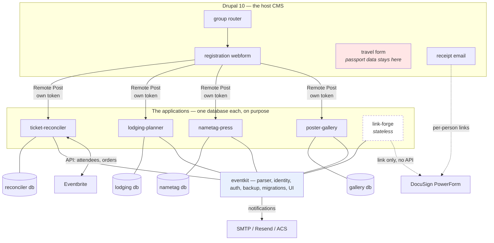
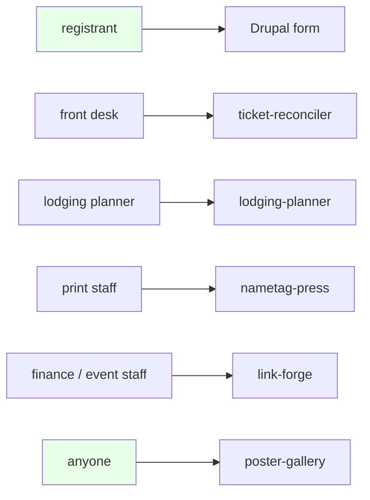
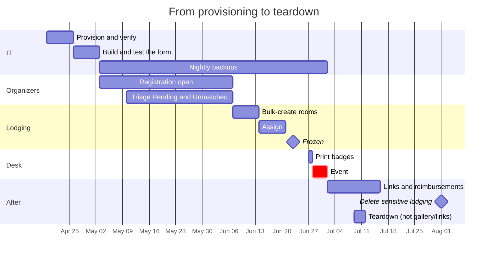

# Architecture

One Drupal form fans out to up to five independent applications. Each keeps its
own database and has no runtime dependency on any other.

## The stack

**Read the separate cylinders as the point, not an accident.** Four databases
holding overlapping copies of the same people is a deliberate trade: no
application can take another down, each can be deployed, torn down and given
access separately, and `link-forge` — which finance staff use — never touches
the database holding revenue figures. The cost is that
[a deletion request is a five-database pass](SECURITY-PRIVACY.md#the-cost-of-independent-databases-a-deletion-request-is-a-five-database-pass),
and it is paid every time.

**Eventbrite connects to `ticket-reconciler` only.** Nothing else knows tickets
exist.

**DocuSign is a dashed line** because there is no API call anywhere in the
stack — it is a URL with parameters. That is why no application holds a DocuSign
credential.

## Who touches what

Only two boxes are reachable without signing in: the Drupal form, and the public
half of `poster-gallery`. Everything else is behind Easy Auth with a per-
application allow-list — which is how finance staff get reimbursement links
without also getting gross revenue.

## The event timeline

## How a registration travels

1. Someone submits the Drupal form. `destination_url` computes a ticket slug
   from the [cascade](https://github.com/pu-shd/drupal-event-forms/blob/main/docs/CONDITIONAL-TICKETING.md).
2. Drupal fires every Remote Post handler configured for **Completed**. Each
   carries its own token in a nested `headers:` block.
3. Each application verifies its token with `compare_digest`, parses the payload
   through the *one* parser in `eventkit.drupal`, derives a `person_key`
   preferring the Drupal submission uuid, upserts, and returns 200 in about
   200 ms — deferring anything slow.
4. `ticket-reconciler` later pulls Eventbrite attendees and matches on email,
   aggregating multiple purchases by the same buyer.

**Handlers are configured for Completed only, with errors ignored and a short
timeout.** Five synchronous handlers on one form is real coupling: without that,
one slow application delays every registrant, and one down application loses
submissions outright. Each webhook must be idempotent, because the fix for a
missed window is replaying from Drupal.

## What holds it together

`eventkit` is a library, not a service. There is no shared runtime, no shared
database, and nothing to deploy centrally. It carries the pieces that must agree
across applications:

- **`identity.person_key`** — frozen and versioned. Change it and every row in
  every database is orphaned.
- **`drupal.parse_submission`** — one parser for both the webhook and the bulk
  importer, asserted by a parity test. There were three, and they disagreed.
- **`auth.EasyAuth`** — a dependency, not a function call you must remember.
- **`backup`** — one format, column list read from the schema rather than
  hand-maintained, so every application's backup imports into every importer.

See [`ADR/`](ADR/) for the decisions behind each.
